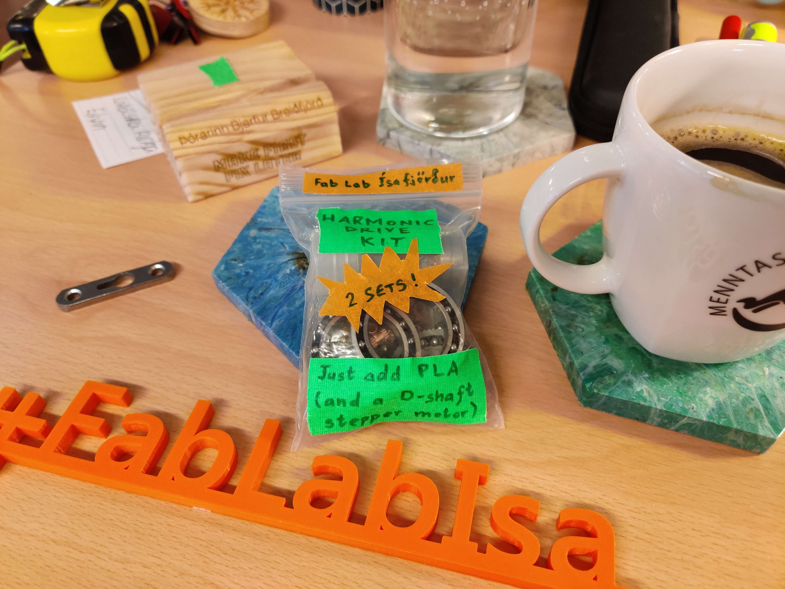

# Harmonic Drive Kit

Verkefni sem Svavar Konráðson bjó til og Þórarinn BB Gunnarson mun leiða og koma með efni að Vestan.

[Leiðbeiningar á síðuni hans Svavars](https://fab.cba.mit.edu/classes/865.24/people/svavar/components/harmonic/)

## um

Erum með tvö set. Þurfum PLA og skrefa mótor með D skafti

### Efni sem þarf að prenta

[3D PRINTED NEMA 17 STRAIN WAVE GEAR (HARMONIC DRIVE)](https://cults3d.com/en/3d-model/tool/3d-printed-strain-wave-gear-harmonic-drive)

Svavar keypti skrána, komum með hana en deilum henni ekki opinberlega.

## Hvað var gert 

Ekki gafst tími til að búa til drif á staðnum en farið var yfir hvaða eiginleika harmonic drive hefur og hva Svavar á Ísafirði hefur verið að fást við.
