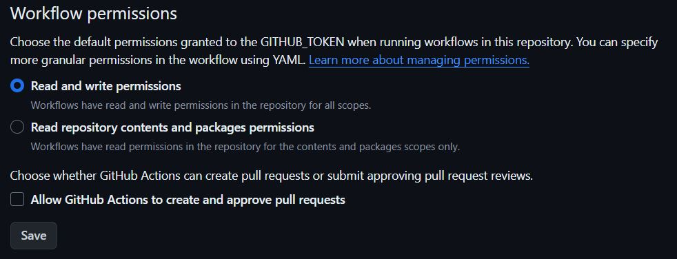
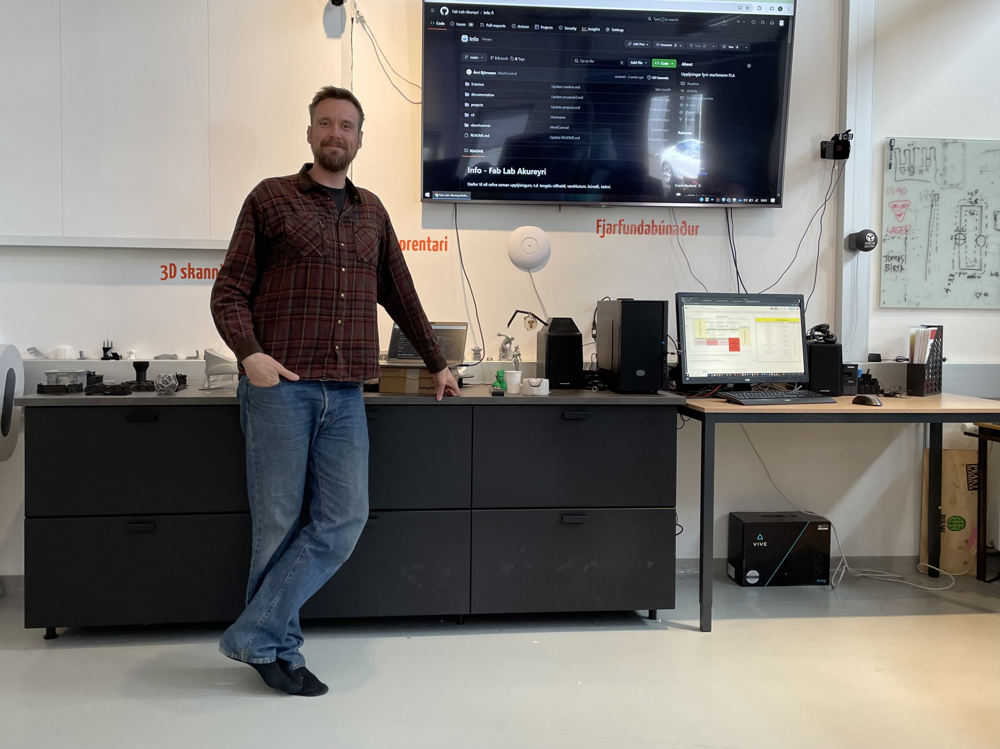

# Git Action

## Hvað eru Github Actions?

[_Github Actions_](https://docs.github.com/en/actions) er sjálfvirkar aðgerðir sem gera notendum kleift að keyra verkefni, prófanir eða aðrar aðgerðir tengd þeim. 

## Ondsel/FreeCAD og Github Actions

Eftir kynningu Svavars á Ondsel langaði mig að bæta smá sjálfvirkni við Ondsel verkefni. 

Ég bjó til [verkefni hér](https://github.com/arnib13/ondselverkefni) til prufu. Það sem við viljum að gerist er að þegar breyttu módeli er ýtt yfir á vefþjóninn, fer aðgerð í gang sem býr til / uppfærir `.STL` skrá í `model`
 möppunni. Til 

Í `model` möppunni er `test.FCStd` Ondsel/FreeCAD skráin. 

Í `.github/workflows/` er skránni `freecad-to-stl.yml` komið fyrir. 

Sú skrá inniheldur upplýsingar á `YAML` formi.

FreeCAD býður upp á forritanlegt viðmót, þ.e.a.s. við getum stýrt FreeCAD frá skipanalínunni. Það er **mjög** hentugt þegar kemur að því að sjálfvirknivæða aðgerðir. 

í stuttu máli inni heldur `.yml` skráin skipanir sem gegnum [Docker](https://www.docker.com/)
 bakenda; 

- Setja upp Ubuntu sýndarvél
- Setur upp FreeCAD og tengdan hugbúnað
- Sækir módelið 
- Opnar það í FreeCAD
- Vistar það sem `.STL` skrá
- Setur skrána inn í `model` möppuna

## YAML

```
name: Convert FreeCAD to STL

on:
  push:
    branches:
      - main
  pull_request:
    branches:
      - main

jobs:
  convert:
    runs-on: ubuntu-latest

    steps:
    - name: Checkout repository
      uses: actions/checkout@v3
      with:
        token: ${{ secrets.GITHUB_TOKEN }}

    - name: Install FreeCAD
      run: |
        sudo add-apt-repository --yes ppa:freecad-maintainers/freecad-stable
        sudo apt-get update
        sudo apt-get install -y freecad freecad-python3

    - name: Create conversion script
      run: |
        echo "import FreeCAD" > convert_to_stl.py
        echo "import Mesh" >> convert_to_stl.py
        echo "doc = FreeCAD.open('model/test.FCStd')" >> convert_to_stl.py
        echo "print('Objects in the document:')" >> convert_to_stl.py
        echo "for obj in doc.Objects:" >> convert_to_stl.py
        echo "    print(obj.Name)" >> convert_to_stl.py
        echo "obj = doc.getObject('Body')" >> convert_to_stl.py
        echo "if obj is not None:" >> convert_to_stl.py
        echo "    Mesh.export([obj], 'model/Pacman.stl')" >> convert_to_stl.py
        echo "else:" >> convert_to_stl.py
        echo "    print('Object Body not found')" >> convert_to_stl.py
        echo "doc.close()" >> convert_to_stl.py

    - name: Convert FCStd to STL
      run: |
        freecadcmd convert_to_stl.py

    - name: List generated STL files
      run: |
        ls -l model/*.stl

    - name: Upload STL files
      uses: actions/upload-artifact@v3
      with:
        name: stl-files
        path: model/*.stl

    - name: Configure git
      run: |
        git config --global user.name 'github-actions'
        git config --global user.email 'github-actions@github.com'

    - name: Commit STL file
      run: |
        git add model/Pacman.stl
        git commit -m "Update Pacman.stl"

    - name: Push changes
      run: |
        git push origin HEAD:main

    - name: Clean up
      run: |
        rm convert_to_stl.py

```

## Ha? Afhverju?

Þetta eingöngu eitt dæmi um hvað er hægt með svona sjálfvirkum keyrslum. Möguleikarnir eru talsvert fleiri. Þegar verkefni verða stærri, flóknari og fleiri koma að þeim, er nauðsynlegt að huga að aðgerðum sem gera vinnuna skilvirkari og útkomuna aðgengilegri. 

Þetta er eitt tól til þess. 

## Ath: 

Til að keyrslan geti bætt við og breytt skrám, þarf að gefa leyfi til þess. 

Það er gert í `Repository` stillingum: 

`Settings` -> `Actions` -> `General` ->  `Workflow permissions` og velja `Read and write permissions`. 



## Takk fyrir mig


Árni Björnsson, Selfoss 2024

[fablab.is](www.fablab.is)
