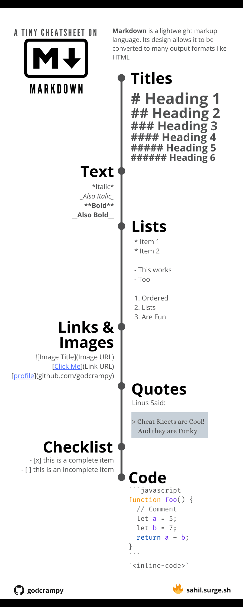



# Git documentation
Teymi: Ólöf, Anna, Bryndís, Doddi

Doddi fór yfir hvernig git er notað til að skjalfesta verkefni og vinnustofur.
Verkefni færa [word skjal]() sem Ólöf bjó til með það hvernig Github er notað

## Ýmsir punktar varðandi GitHub

[Hér](https://www.markdownguide.org/cheat-sheet/) má finna hlekk inn á svindllista með helstu aðgerðum.

## Að búa til möppu

- Möppur/repository eru búnar til í listanum til vinstri.

- Búa til markdown

- Nota hashtag fyrir framan setningar til að velja heading. 1 hashtag jafngildir heading 1, 2 hashtag jafngilda heading 2 o.s.frv.

## Til að setja inn myndir:

- Fara inn í möppu/repository.

- Ýta á punkt til að fá upp vinnusvæði/web editor (virkar bara þegar þú ert inni í möppu/repository).

- Hlaða myndinni inn í möppu sem kallast img. Æskilegt er að myndin sé undir 500 kb.

- Opna svo réttu möppuna sem myndin á að fara í.

- Draga myndina úr trénu yfir í möppuna og passa að sleppa ekki heldur ýta á shift takkann þegar búið er að draga myndina á réttan stað.

- Skrifa eitt orð sem lýsingu á myndinni innan hornklofans.

- Fara í tréð vinstra megin. Þar ætti að vera komin tilkynning (lítill blár punktur).

- Ofarlega til vinstri á að skrifa stutta lýsingu á því hvað verið var að gera og smella svo á Commit & Push.

- Í möppunum má finna Readme.md sem er skjal með heildarupplýsingum um möppuna.

## Að finna nánari leiðbeiningar:

- Til að finna upplýsingar um GitHub á netinu er hægt að nota leitarorðin GitHub cheat sheet eða GitHub markdown. Dæmi:

<https://res.cloudinary.com/practicaldev/image/fetch/s--U_TEB7k7--/c_limit%2Cf_auto%2Cfl_progressive%2Cq_auto%2Cw_800/https://dev-to-uploads.s3.amazonaws.com/i/5zhubbpov3m3ly9a1t9c.png>

## Að vinna án netsambands:

- Þegar unnið er án netsambands er hægt að fara í File Explorer og opna GitHub. 

- GitHub möppur = býður upp á skýjatengingu. Fyrst þarf að ,,clone“ frá GitHub á netinu.

- Hægt að opna NotePad og draga skjöl yfir í það. Þá birtist texti skjalsins í NotePad.

## Að flytja út PDF skjöl:

Hægt að flytja markdown út sem PDF skjal.

## Að setja hlekk á bakvið orð:

- Ef hornklofi er settur utan um orð er hægt að setja hlekk undir það.

`[Hlekkur](https://www.mbl.is)` -> [Hlekkur](https://www.mbl.is) 

## Að tengja, virkja eða skipuleggja yfirsíður og undirsíður

- Þessu er hægt að stýra með því að fara inn í README.md 
- Heiti undirsíðunnar er skrifað innan í hornklofa. Það mun virka sem hnappur/hlekkur inn á undirsíðuna.
- Þar á eftir er heiti markdown/möppunnar skrifað innan í sviga og þess gætt að ekki sé bil á milli hornklofans og svigans.
- Á eftir sviganum er haft eitt bil áður en venjulegur, stuttorður texti er skrifaður. Þetta getur t.d. verið nafn þess sem sér um síðuna eða nánari lýsing/athugasemdir.

## Github issues

- Hægt að gera Github issues sem er sniðugt til að halda utanum um hluti sem þarf að laga. Tilvalið ef eitthvað finnst sem virkar ekki eða er ekki rétt en ekki kunnátta til að laga það þá er jafnvel er hægt að merkja það (assign) einhverjum notenda sem hefur þekkingu til. Hægt er a velja ákveðinn merkimiða (label)
- Github issues gerir það líka kleift að rekja vandamál sem kunna að koma upp.

## Tutorial for GitHub flow:

<https://docs.github.com/en/get-started/start-your-journey/hello-world>