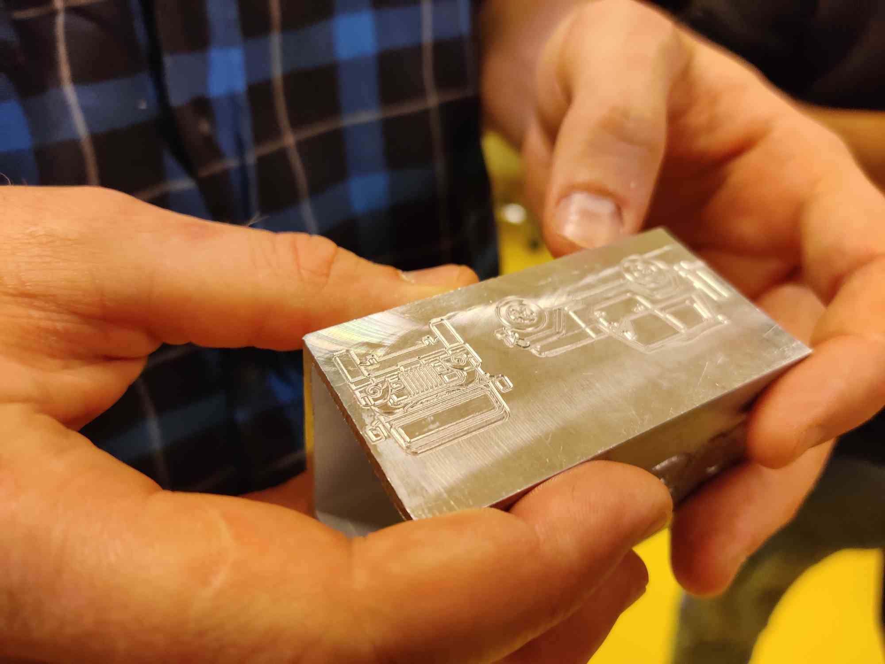

# Haas málmfræsari og tölvutríðar málmvinsluvélar

*Borgþór Helgason Kennari: Málmiðn, fagstjóri málmiðngreina*

Borgþór fór yfir hvernig tölvuteikningar og tölvustýrðar vélar eru notaðar í málmsmíðakennslu í FSU

