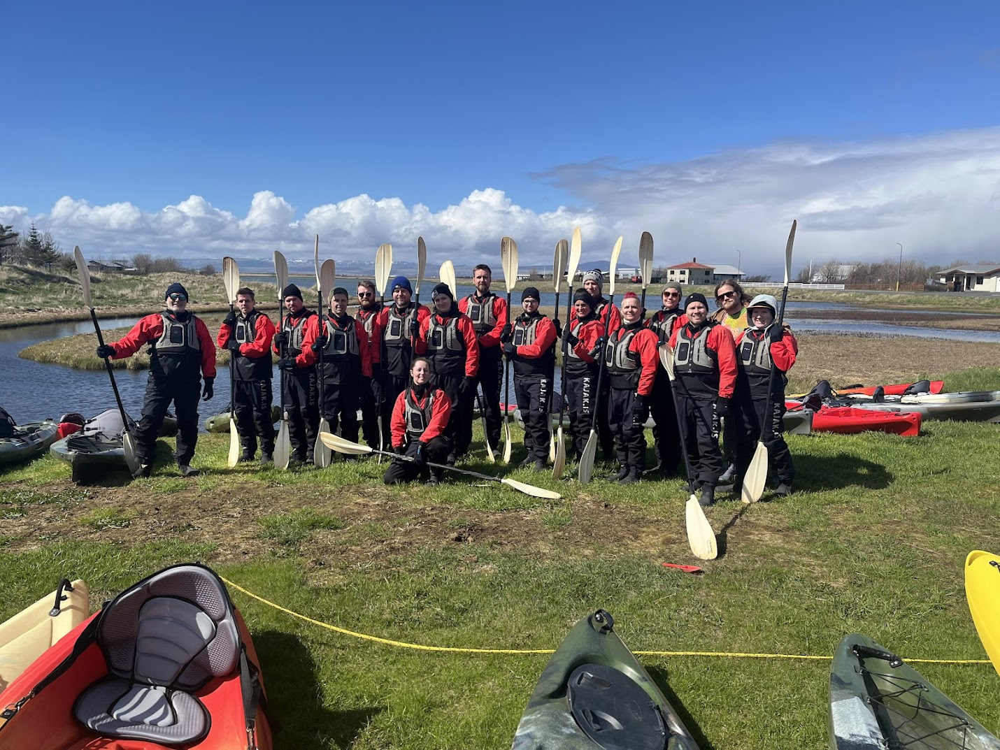
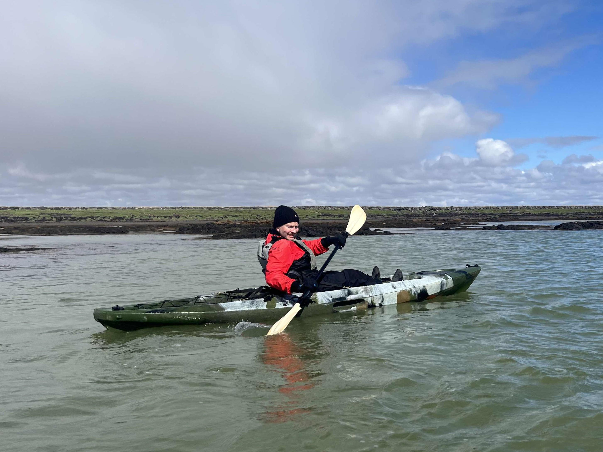
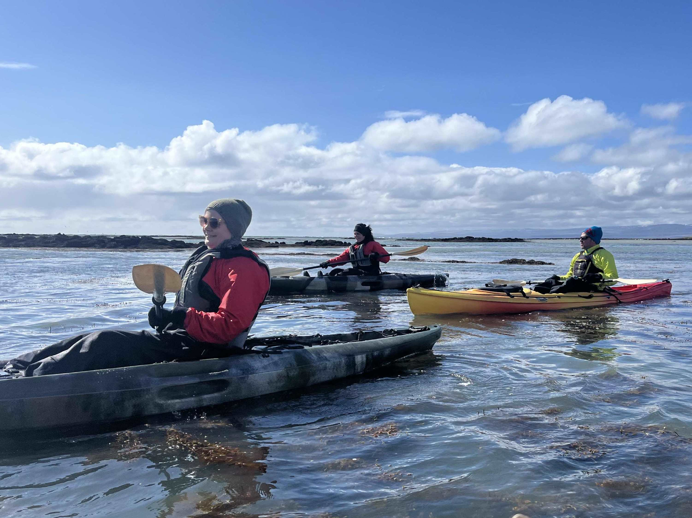
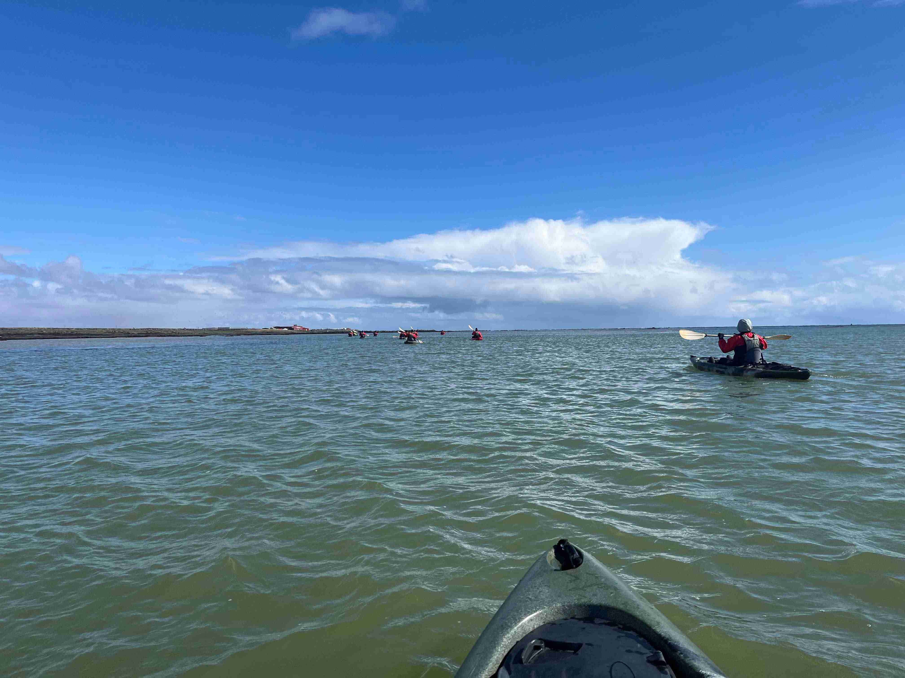

# Hópefli

## Kajakferð sem hópefli

Kajakferðin var farin í fylgd leiðsögumanna frá [Kajakferðum](https://www.kajak.is/).

Ferðin hófst á tjörn við Stokkseyri. Frá henni var siglt eftir skurðum á milli lítilla vatna. 

Eftir að hafa þrætt leiðina í gegnum skurðina leiddi árfarvegur hópinn út í sjó. Þar sigldi hópurinn eftir strandlengjunni í fylgd forvitinna sela og fugla.

Kajakferðinni lauk í höfninni við Stokkseyri þar sem hópnum var skipt í tvennt og keppti í boðróðri. 

Ferðin var mikil upplifun og mun seint gleymast.

