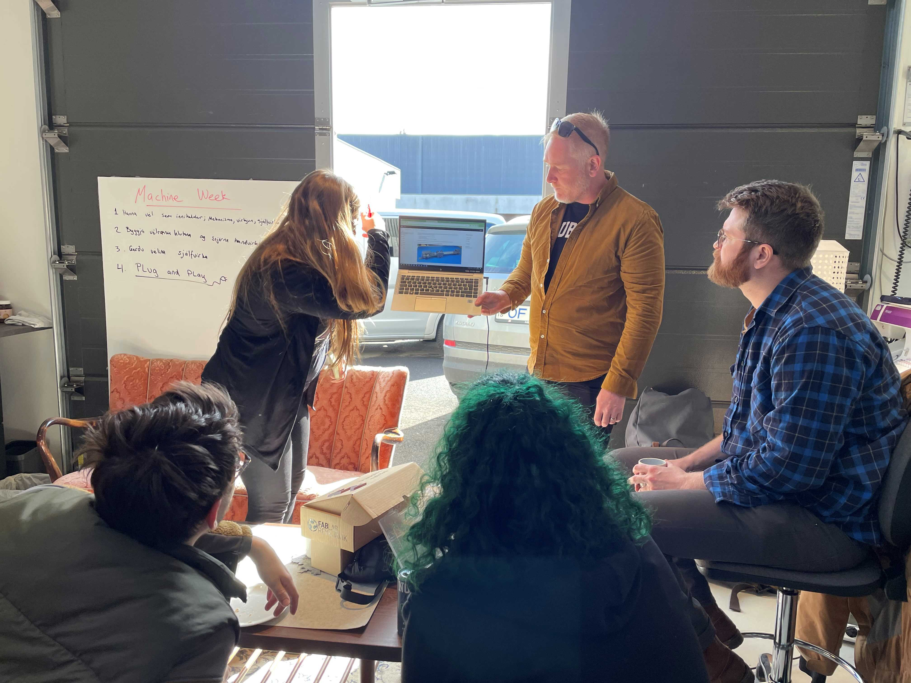

# Macine Making

Teymi: Þóra, Andri, Anna, Janek

Markmið hanna og búa til sósu vél fyrir tacos

## pumpa

Janek og Jón Þór sáu um að hanna og smíða pupmpu fyrir vélina
[módel]()*vantar hlekk*

## Rafpartur / electronics

[x] finna 5 volta regulator
[rás til að breyta 12v í 5v með lm7805](https://www.circuits-diy.com/12v-to-5v-converter-using-lm7805-ic-power-supply/)
[LM7805 data sheet](https://www.sparkfun.com/datasheets/Components/LM7805.pdf)

[rafrás]()*vantar hlekk*

## Útlitshönnun / logo

Anna sá um að logo fyrir vélina

