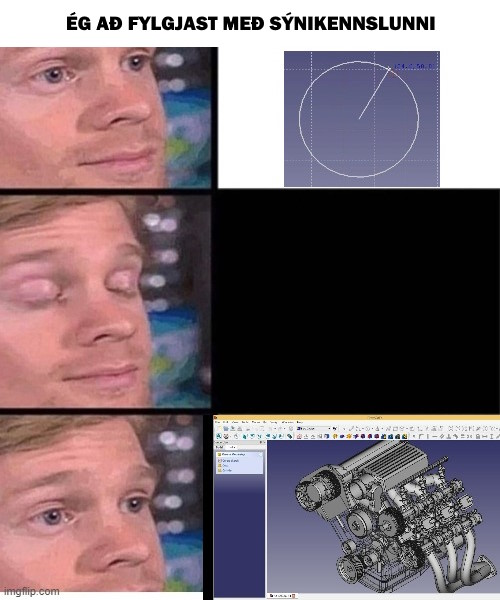
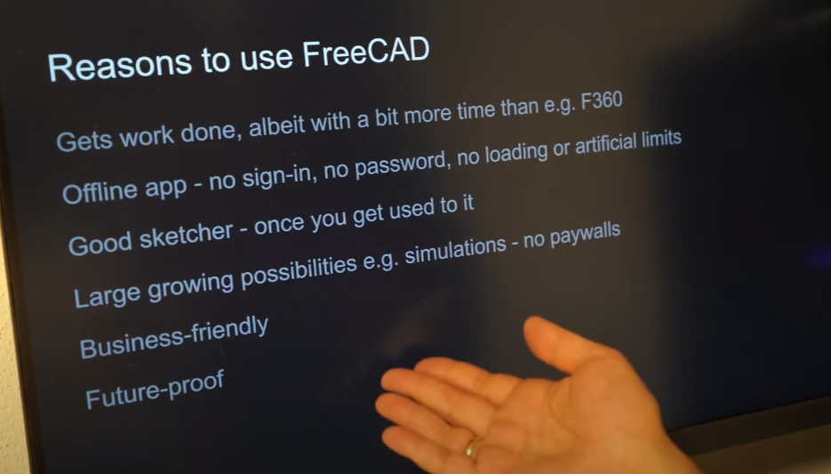
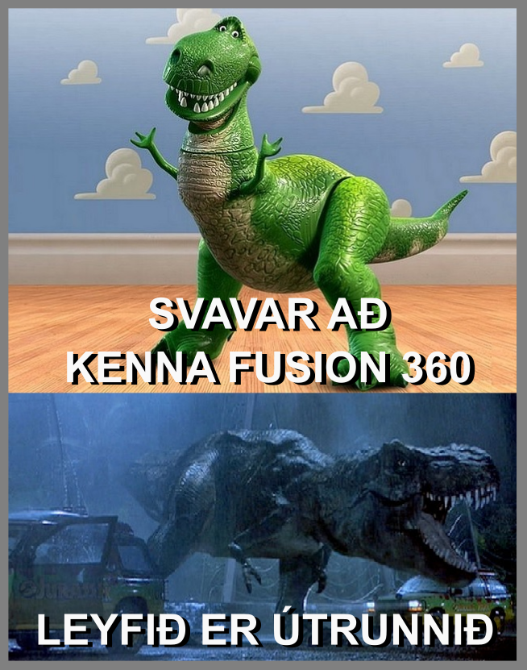

# Ondsel

[Svavar Konráðsson](https://fabacademy.org/2023/labs/isafjordur/students/svavar-konradsson/)

*Allt sem þú þarft til að bjarga þér í CAD teikningu í Ondsel ES.*

<iframe width="560" height="315" src="https://www.youtube.com/embed/i39DY5ox054?si=Hz6eAGCTF7t7cxSM" title="YouTube video player" frameborder="0" allow="accelerometer; autoplay; clipboard-write; encrypted-media; gyroscope; picture-in-picture; web-share" referrerpolicy="strict-origin-when-cross-origin" allowfullscreen></iframe>

Náið í Ondsel ES hér:    
[Windows](https://github.com/Ondsel-Development/FreeCAD/releases/download/2024.2.0/Ondsel_ES-2024.2.0.37191-Windows-x86_64-installer.exe), [Intel Mac](https://github.com/Ondsel-Development/FreeCAD/releases/download/2024.2.0/Ondsel_ES_2024.2.0.37191-macOS-intel-x86_64.dmg), [Apple Silicon](https://github.com/Ondsel-Development/FreeCAD/releases/download/2024.2.0/Ondsel_ES_2024.2.0.37191-macOS-apple-silicon-arm64.dmg), [Linux](https://github.com/Ondsel-Development/FreeCAD/releases/download/2024.2.0/Ondsel_ES_2024.2.0.37191-Linux-x86_64.AppImage).

## Hvað er CAD?

*Sum okkar handgerðu tækniteikningar í skóla. Það er gaman að fá að prófa það, en þetta er ofboðslega tímafrekt. Mynd frá [imgur](https://imgur.com/gallery/big-paper-days-of-engineering-technical-drawings-architecture-etc-before-computers-printers-lNJf76s)*.

CAD ([Computer-Aided Design](https://en.wikipedia.org/wiki/Computer-aided_design)) er tækniteikning sem er gerð í tölvu. Markmiðið er að gera nákvæmlega málsettar línuteikningar í hvaða skala sem er.

*Mesh vs B-Rep í þrívídd er ekki ósvipað og raster vs vector í tvívídd. Mynd úr [FreeCAD Manual](https://wiki.freecad.org/Manual:Traditional_modeling,_the_CSG_way)*.

3D CAD er vektor teikning í þrívídd; þ.e. það er hægt að skala hana upp og niður og hún er alltaf hnífskörp. Þetta kallast Boundary Representation eða [B-Rep](https://fab.cba.mit.edu/classes/865.24/topics/design-tools/#brep). Aðrar helstu aðferðir við að teikna í þrívídd eru [mesh](https://www.blender.org/), [voxel](https://fab.cba.mit.edu/classes/865.24/topics/design-tools/#mesh-voxel) og [F-Rep](https://fab.cba.mit.edu/classes/865.24/topics/design-tools/#frep). 

Að nota málsetningar og skorður til að skilgreina hluti nákvæmlega er nauðsynlegt til að setja hluti í framleiðslu, sérstaklega þegar hlutir þurfa að passa saman.

Sjá meiri fróðleik í fyrirlestrinum [CAD in 1 Hour](https://fab.cba.mit.edu/classes/865.24/topics/design-tools/) sem [Leo McElroy](https://fab.cba.mit.edu/classes/865.21/people/leo-mcelroy/#/about) flutti í námskeiðinu [How to Make Something that Makes (almost) Anything](https://fab.cba.mit.edu/classes/865.24/index.html). ([Upptaka](https://mit.zoom.us/rec/play/PYzhtH4Dv6tDTwZBjTWbA1PyXpLZmds9JrbTRoO_ZbhE8GKzYnvZiICaBB3aFLuuV39E-ICZ7r4hfyPQ.5Qhg_-_KOTtND4yy?canPlayFromShare=true&from=share_recording_detail&continueMode=true&componentName=rec-play&originRequestUrl=https%3A%2F%2Fmit.zoom.us%2Frec%2Fshare%2FmSbxXU1ap3euZp8TjonDAqmOeXrBUwPXN9e-dJ2e2kWVZ_HxQu6PQFhioWVrFPtt.O3SoIRlOUhdLGrsS))

## Mín reynsla

[Ég skipti um skoðun á frjálsum teiknihugbúnaði](https://fabacademy.org/2023/labs/isafjordur/students/svavar-konradsson/assignments/week02.html#on-free-and-open-source-engineering-software) þegar ég tók þátt í Fab Academy. Áður notaði ég [Inventor](https://teamspark.is/img/ts12-1.jpg) og [SolidWorks](https://files.svavar.cc/old_work/ribs.jpg), sem kosta hundruð þúsunda króna á ári, og leit ekki við neinu öðru. Autodesk bauð mér tvisvar til útlanda; á [stúdentaráðstefnu á Spáni](https://www.youtube.com/watch?v=RZ0dcDp1KXI) og á [Autodesk University í Las Vegas](https://adsknews.autodesk.com/en/stories/autodesk-university-2013-opening-keynote-urges-attendees-to-go-outside/). Ég ætti að vera þeirra helsti talsmaður!

Og ég var það. Þessi forrit eru [frábær](https://files.svavar.cc/old_work/fea.jpg). En að útvega leyfi og halda því er ekki skemmtilegt. Ég hef svo oft ætlað að skoða teikningar aftur seinna og þá er hugbúnaðarleyfið mitt runnið út. Hér eru tvær greinar frá Ondsel teyminu sem ég tengi hart við:

[Autodesk is teaching students hard life-lessons about vendor lock-in](https://ondsel.com/blog/hard-lessons/)

[Autodesk continues to enshittify Fusion 360 with a 27% price increase](https://ondsel.com/blog/autodesk-enshittifies-fusion-360/)

Þegar fyrsti tíminn í Fab Lab áfanganum var að hefjast í MÍ í janúar, þá sagði Fusion mér að leyfið mitt væri útrunnið. Það er vel hægt að finna út úr því, en ég var orðinn ansi leiður á að standa í leyfisveseni fyrir mig og nemendur mína, svo að ég skipti snarlega yfir í FreeCAD. Það tók nemendurna álíka langan tíma að ná í FreeCAD á allar tölvurnar og það tekur að fá Fusion leyfi. Og við Doddi gátum alveg lært á FreeCAD þegar hann kom aftur frá [Nordic Bootcamp](https://nordicfablabs.org/bootcamp-2024-finland/) og komst að því að ég væri búinn að skipta um CAD forrit í smiðjunni. 

Að teikna í FreeCAD var svolítið stirt til að byrja með, en menntaskólanemendurnir komust allir í gegnum eitt örstutt myndband frá Neil og eitt af Youtube myndböndunum hér fyrir neðan. Sum notuðu FreeCAD til að teikna lokaverkefnin sín. Í kennslukönnuninni sagði einn nemandinn "Ekki fokking Freecad." Ég skil. Það eru ýmsir hnökrar á forritinu (og kennararnir voru að læra á það á sama tíma og nemendurnir).

Svo kom Ondsel, sem er þægilegri útgáfa af FreeCAD.

### Hvers vegna ekki Ondsel/FreeCAD?
- Vinnuflæðið er [innblásið af CATIA](https://ondsel.com/blog/catia-suffers-from-the-same-problems/) og er aðeins öðruvísi en CAD forritin sem flestir eru vanir. 
- Suma fídusa vantar. Ég vil geta fært skipanir upp og niður í trénu með músinni! Það er að vísu hægt að velja [initiate dragging](https://wiki.freecad.org/Std_TreeDrag) eða hægrismella á fídusa og velja Move object after other object, en ég fæ oft villuboð þar sem mér finnst að færslan ætti að ganga upp.
- [Viðmótið getur verið svolítið stirt](https://www.reddit.com/r/cad/comments/rvesuy/is_freecad_good/) (ég átta mig ekki á hvernig á að nota Array transform í 2D skissu, ég nota 3D linear pattern í staðinn)
- Það eru villur í forritinu [hér og þar](https://youtu.be/-kcSx4m_0EA?si=T0T6XX1-_iW0etyj).

## Hvers vegna Ondsel/FreeCAD?

<iframe width="560" height="315" src="https://www.youtube.com/embed/udIBhVIy5MI?si=g7LZe4lDToAry7O2" title="YouTube video player" frameborder="0" allow="accelerometer; autoplay; clipboard-write; encrypted-media; gyroscope; picture-in-picture; web-share" referrerpolicy="strict-origin-when-cross-origin" allowfullscreen></iframe>

*[Graphic design is my passion](https://cdn.dribbble.com/users/58639/screenshots/3788063/media/dc42f0f17659e22bb63884a4318f2c05.jpg?resize=800x600&vertical=center).*

- Mun öflugra teikniforrit en flestir gera sér grein fyrir, byggt á sama [góða grunni](https://en.wikipedia.org/wiki/Open_Cascade_Technology) og KiCAD. Hægt er að teikna (nánast) allt í Ondsel, vinna með mesh, útbúa toolpaths, gera burðarþolsgreiningar, gera smíðateikningar, gera teiknivinnu sjálfvirka með Python forriti og fleira.
- Hægt að hanna [vörur sem eru settar á markað](https://blog.freecad.org/2024/04/12/forged-in-freecad-lumenpnp-an-open-source-pick-and-place-machine/) í forritinu
- Er að þróast mjög hratt núna. Hversu hratt? Á rúmlega tuttugu árum hefur FreeCAD tekist að komast upp í útgáfu 0.21.2. Á síðasta ári fór verkefnið á flug og [útgáfa 1.0](https://blog.freecad.org/2024/05/15/upcoming-feature-freeze-and-ui-freeze-for-freecad-1-0/) verður líklega gefin út á þessu ári!
- Frjáls hugbúnaður er hluti af menningu Fab Lab smiðja.
- Frjáls hugbúnaður er frábær vegna þess að leyfið rennur ekki út. Þú hefur alltaf aðgang að forritinu og teikningunum þínum. 
- Gestir þínir í Fab Lab þurfa ekki að búa til Fusion eða TinkerCAD reikning til að teikna einfaldan hlut og búa til. 
- Svo er hægt að ná í Ondsel eða FreeCAD og halda áfram að teikna heima. 
- Allir geta skoðað kóðann á bak við teikniforritið og geta breytt og bætt að vild. Margir hafa lagt af mörkum verkfæri í FreeCAD og byggt upp [virkni sem er ekki til annars staðar](https://wiki.freecad.org/Rocket_Workbench). 
- Hægt er að komast hratt af stað með 
[örstuttu myndböndunum úr Fab Academy](http://academy.cba.mit.edu/classes/computer_design/index.html).
- [Pieter Hijma](https://fabacademy.org/2023/labs/waag/students/pieter-hijma/), sem tók Fab Academy í fyrra, er hluti af Ondsel teyminu. Hann bjó til [OSH Automated Documentation workbench](https://osh-autodoc.org/), sem býr sjálfvirkt til samsetningarleiðbeiningar út frá þrívíðum módelum. Við getum kvartað beint við hann á [Mattermost](https://chat.academany.org/). Það [gladdi Ondsel teymið](../img/ondsel/mattermost_chat.jpg) að við værum strax byrjaðir að nota það í kennslu. Og [Doddi](https://fabacademy.org/archives/2015/eu/students/gunnarsson.thorarinn_b.b/index.html) bjó til meme:

### Hvers vegna Ondsel frekar en FreeCAD

- Ondsel hjálpar manni að byrja teikninguna á [réttan hátt](https://youtu.be/U2_x2RqJb7Q?si=dOPH_YwSSwkCY-nB)
- Þægilegri litir og skipulag
- Stillt á Blender mús, sem er þægilegri en sú sem er default í FreeCAD (Að vísu getur verið þægilegra að hafa músina stillta á CAD þegar maður er að vinna í tvívíðri skissu)
- Mun þægilegri málsetningar í 2D skissum
- Búið að bæta við [midpoint constraint](https://youtube.com/shorts/1ZFCw8LydxA?si=zVfEt8pCvrdBNxmn), mjög mikilvægt
- Hjálparlínur í 2D skissum (construction geometry) eru strikalínur, eins og þær eiga að vera
- Nýja 3D mæliverkfærið
- Ondsel assembly workbench (ég notaði hann [hér](https://fab.cba.mit.edu/classes/865.24/people/svavar/system/files/model-viewer/))
- Workbench fyrir tölvustýrða fræsingu heitir Path í FreeCAD en CAM í Ondsel, sem er mun skiljanlegra
- Ondsel er open source eins og FreeCAD og leggur áherslu á að koma fídusum úr Ondsel inn í FreeCAD

Ég verð að segja að það er snjallt hjá Ondsel teyminu að tækla FreeCAD, því að grunnurinn er góður, það þarf aðallega að fínpússa viðmótið. Hver vinnur í sínum workbench í sínu horni án þess að leggja vinnu í að samhæfa allt saman. "System integration" er jafnmikilvægt í hugbúnaði og það er í [vélbúnaði](https://fablabisafjordur.github.io/system-integration-tips/). Það er það sem Ondsel gerir.

Núna er líklega rétti tíminn til að fara af stað með Ondsel, svo að það geti tekið fullan þátt í að leysa topological naming problem og að gefa út útgáfu 1.0 af FreeCAD. Og stóru CAD fyrirtækin eru ekki óendanlega langt á undan; það er nóg að búa til eitthvað svipað og Inventor var fyrir 10-15 árum síðan.

### Hvers vegna gæti verið gott að hinkra með að skipta yfir í Ondsel?

<iframe width="560" height="315" src="https://www.youtube.com/embed/6p2vqEEmWq4?si=DuXiw5dIsPyy8_rw" title="YouTube video player" frameborder="0" allow="accelerometer; autoplay; clipboard-write; encrypted-media; gyroscope; picture-in-picture; web-share" referrerpolicy="strict-origin-when-cross-origin" allowfullscreen></iframe>

- [Topological naming problem](https://youtu.be/6p2vqEEmWq4?si=2rqe8Ff-KkaQpWYM) er stærsta og versta villan. Þetta er vandi sem allur CAD hugbúnaður þarf að leysa og ég hef rekist á hann einstaka sinnum í mjög dýrum forritum. 

[Zheng Lei](https://www.youtube.com/@leizheng3561/videos) (a.k.a. [realthunder](https://github.com/realthunder)) gerði fork (afrit) af FreeCAD kóðanum og [leysti vandamálið](https://forum.freecad.org/viewtopic.php?t=78797)! Nú vinnur Ondsel teymið hörðum höndum að því að koma lausninni inn í opinbera kóðann án þess að brjóta módel sem hafa verið gerð í eldri útgáfum af FreeCAD. Þess vegna mæli ég með að bíða eftir næstu útgáfu af Ondsel áður en forritið er tekið í almenna notkun í Fab Lab smiðjum.

## Sýnikennsla

### Hvernig teiknar maður hluti í CAD forriti?

CAD teikning snýst að miklu leyti um að skipta hlutum upp í einföld form sem er hægt að búa til með tvívíðum skissum:

<iframe width="560" height="315" src="https://www.youtube.com/embed/tRNc6AhG7b8?si=0H9XlU1VFLdlvdsu%loop=1" title="YouTube video player" frameborder="0" allow="accelerometer; autoplay; clipboard-write; encrypted-media; gyroscope; picture-in-picture; web-share" referrerpolicy="strict-origin-when-cross-origin" allowfullscreen></iframe>

Til þess að geta bjargað sér í CAD teikningu er í raun nóg að læra að gera tvívíðar teikningar með málsetningum (dimensions) og skorðum (constraints):

<iframe width="560" height="315" src="https://www.youtube.com/embed/gbNg3mzm84s?si=QRbz4QEDg4He6aLf" title="YouTube video player" frameborder="0" allow="accelerometer; autoplay; clipboard-write; encrypted-media; gyroscope; picture-in-picture; web-share" referrerpolicy="strict-origin-when-cross-origin" allowfullscreen></iframe>

*Þið getið líkað notað [þetta skjal um Sketcher](../files/ondsel/sketcher.pdf) sem Doddi deildi með mér.*

Síðan notar maður Pad, Pocket, Revolve, Loft eða Sweep til að búa til þrívíðan hlut úr skissunni.

Til að staðsetja skissurnar í þrívíðu rými er gott að búa fyrst til [nýtt plan](https://youtu.be/nGI1_1QTdyg?si=HeSK9EhkHwQgJuN9) til að skissa á. [Hér](https://youtu.be/j6C53zTszx0?si=5iCFKoaCD162Lpsm) er líka þægileg aðferð til að færa til skissur.

### Hlutir til að passa sig á

- Í öllum CAD forritum þarf að passa upp á að [tvívíða skissan sé lokuð](https://youtu.be/w7_jCxxN1OY?si=ixnz_cEuqz7DVGvh) áður en henni er breytt í 3D hlut. Þ.e. að línur séu tengdar saman á endapunktum og skarist ekki. Þetta er oftast vandamálið þegar það er virkar ekki að búa til þrívíðan hlut úr tvívíðri skissu. 

Ondsel hefur nokkrar sérviskur sem fá fólk til að gefast fljótt upp og fara aftur í Fusion. En ef þið vitið af þeim þá getið þið klórað ykkur fram úr hlutunum:

<iframe width="560" height="315" src="https://www.youtube.com/embed/wXfEf8D-JDk?si=OCvBg4y1FOpVksmv" title="YouTube video player" frameborder="0" allow="accelerometer; autoplay; clipboard-write; encrypted-media; gyroscope; picture-in-picture; web-share" referrerpolicy="strict-origin-when-cross-origin" allowfullscreen></iframe>

*Þetta gæti verið mikilvægasta myndbandið til að lifa af lengur en fimm mínútur í Ondsel.*

- Þú *verður* að vera með rétt Body valið til þess að Ondsel leyfi þér að gera Pad, Pocket, Revolve, o.s.frv. En það er til leið til að [nota form úr öðru Body í skissu með Shape Binder](https://youtu.be/rfMlpxLulxY?si=h9_MquBqBqZeVfJK). Shape Binder er ekki til í öðrum CAD forritum því að þau leyfa manni vanalega að nota línur á einu Body í skissu í öðru Body. Þessi sérviska takmarkar ekki það sem maður getur teiknað í Ondsel en hún bætir við aukaskrefi.
- Síðan er mikilvægt að vita að það er bara hægt að hafa einn prófíl í hverri skissu. Það er takmarkandi en líka góð venja í CAD teikningu. Og það er hægt að nota [master skissu](https://youtu.be/k6lMaQiIlKo?si=NBaXXGe8sX_AslgZ) til að stýra öllum hinum skissunum. 

### Góð ráð

*Meme frá Jens*

Ég mæli með að vera alltaf í Part Design workbench, búa til Body og búa svo til Sketch.

Það er góð venja að setja málsetningar og skorður þangað til allar línur í skissunni verða grænar. Þá er skissan "fully constrained" og módelið verður mun stöðugra. Hvítar línur eru "not fully constrained", grænar línur eru "fully constrained" og bláar strikalínur eru ["construction geometry"](https://youtu.be/6PeJ_zJt15A?si=zscvNunVm0c3siMN), þ.e. hjálparlínur sem verða ekki notaðar í að búa til þrívíðan hlut úr skissunni. Það má hægrismella á línur til að breyta þeim í hjálparlínur.

Það er vont ef stærðir eru óskilgreindar, þá er erfiðara að breyta þeim á kerfisbundinn hátt. Jafnvel þótt ég sé að teikna eitthvað þar sem nákvæm stærð skiptir ekki máli, þá stilli ég það eftir auganu, og geri síðan málsetningu; fæ upp annski 47,345 mm og slæ inn næstu heilu tölu, kannski 47 eða 50 mm. Þá er skissan vel skilgreind og ég get breytt þessari tölu ef ég loka skissunni og sé að það þarf að breyta stærðinni aðeins. 

En meginreglan sem ég nota ómeðvitað er að reyna að stilla sem mest af með því að nota skorður fyrst, og síðan bæta við málsetningum þar sem það er nauðsynlegt. Annars getur orðið svolítið kraðak af málsetningum í skissunni. Hér nota ég bara fimm málsetningar til að stýra stærð og staðsetningu allra línanna (hvernig gæti ég fækkað málsetningunum enn frekar?):

*Þegar skissan er sett upp svona, þá er hægt að breyta henni allri með því að breyta einni málsetningu (parameter). Svona virkar parametrísk hönnun. Og þar sem hluturinn er samhverfur bæði á X og Y ás, þá gæti ég teiknað bara fjórðung af honum og svo speglað honum yfir X og Y ás. Í þessu tilviki notaði ég spegilskorður í skissunni og notaði bláu 45° hjálparlínurnar sem spegillínur.*

Ýttu á bilstöngina til að fela og sýna hluti í trénu.

Þegar þú býrð til skissu eða gerir aðra skipun þá birtist hún í tímaröð í trénu (Tree view) vinstra megin. Þú getur tvísmellt á skipunina til að breyta henni eftir á. Stundum birtast torkennileg tákn á skipununum. Skoðaðu [Tree view greinina](https://wiki.freecad.org/Tree_view) til að sjá hvað þessi "overlay icons" þýða.

Þegar ég opna skissu finnst mér þægilegast að [slökkva á grid](../img/ondsel/grid.mp4). Það getur líka verið þæglegt að slökkva á snap, sem er takkinn þar við hliðina.

Þegar þú velur hluti í trénu vinstra megin (Feature tree), skoðaðu þá Property View sem birtist hægra megin. Þar geturðu breytt staðsetningu hluta og líka breytt öllum málsetningum án þess að opna skipunina eða skissuna:

 *Þegar maður lærir aðeins á Property View hérna hægra megin þá verður maður mun sneggri að stilla af stærðir á hlutum. Hér er ég búinn að velja Pocket001 í trénu vinstra megin og þá birtast allar helstu tölur um þá skipun hægra megin.*

Ég mæli með að [hækka upplausnina á STL export](https://youtu.be/v6FgTIpsCKo?si=Pyry4s0iSeSoPA7o) áður en þið þrívíddarprentið.

Gerðu fleiri einfaldar skissur frekar en eina flókna.

Það er svo mikilvægt að klára að teikna áður en maður byrjar að smíða. Annars passa hlutir ekki saman. Ég segi þetta af biturri reynslu. Það  hefur þó alltaf verið hægt að redda hlutunum. En ekki hafa það eftir mér!

Það er ekki hægt að nota útkomuna úr 3D transform (t.d. scale, pattern) í annað transform. Til þess þarf að nota [MultiTransform](https://youtu.be/apmOpkY6n0E?si=8nYOrOmQujFkix-R).

Þegar maður nær tökum á að nota skorður (constraints), þá er hægt að skissa fljótt upp hugmyndir að mekanismum:

<a href="https://fab.cba.mit.edu/classes/865.24/people/svavar/system/tool_rack/"><video width="100%" autoplay muted loop>
    <source src="https://fab.cba.mit.edu/classes/865.24/people/svavar/system/images/tool_rack_2d_sketch.mp4" type="video/mp4">
    Your browser does not support the video tag.
</video></a>

## Æfingar

### Myndbönd úr Fab Academy

Veljið ykkur eitt af eftirfarandi myndböndum til að fara eftir í Ondsel. Takið eftir í hvaða workbench þið þurfið að vera til að fá réttu verkfærin.

- [pad pocket](http://academy.cba.mit.edu/classes/computer_design/pocket.mp4) - Byrjið hér! Mikilvægast!
- [constraints](http://academy.cba.mit.edu/classes/computer_design/2Dconstraints.mp4) - Hjartað í CAD teikningu
- [workbenches](http://academy.cba.mit.edu/classes/computer_design/workbenches.mp4) - Fídusar í boði í Ondsel/FreeCAD
- [snaps](http://academy.cba.mit.edu/classes/computer_design/snaps.mp4)
- [coordinates containers](http://academy.cba.mit.edu/classes/computer_design/coordinates.mp4)
- [extrude](http://academy.cba.mit.edu/classes/computer_design/extrude.mp4)
- [revolve](http://academy.cba.mit.edu/classes/computer_design/revolve.mp4)
- [loft](http://academy.cba.mit.edu/classes/computer_design/loft.mp4)
- [sweep](http://academy.cba.mit.edu/classes/computer_design/sweep.mp4)
- [constructive solid geometry (CSG)](http://academy.cba.mit.edu/classes/computer_design/CSG.mp4)
- [symmetry](http://academy.cba.mit.edu/classes/computer_design/symmetry.mp4)
- [fillet chamfer](http://academy.cba.mit.edu/classes/computer_design/filletchamfer.mp4)
- [offset](http://academy.cba.mit.edu/classes/computer_design/offset.mp4)
- [links hierarchy](http://academy.cba.mit.edu/classes/computer_design/links.mp4)
- [construction](http://academy.cba.mit.edu/classes/computer_design/construction.mp4) - Hjálparlínur (construction lines) sjást betur í Ondsel
- [projection, section](http://academy.cba.mit.edu/classes/computer_design/section.mp4)
- [alignment](http://academy.cba.mit.edu/classes/computer_design/alignment.mp4)
- [assemblies](http://academy.cba.mit.edu/classes/computer_design/assemblies.mp4) - Assembly3 workbench í FreeCAD (Ondsel er þægilegra)
- [measurement](http://academy.cba.mit.edu/classes/computer_design/measurement.mp4) - Hvernig maður mælir í FreeCAD (Mun betra í Ondsel)
- [folding](http://academy.cba.mit.edu/classes/computer_design/fold.mp4)
- [parametric](http://academy.cba.mit.edu/classes/computer_design/parametric.mp4) - Ég notaði þessa aðferð [hér](https://fab.cba.mit.edu/classes/865.24/people/svavar/components/images/cable_carrier/parametric_cable_carrier.mp4)
- [programming](http://academy.cba.mit.edu/classes/computer_design/console.mp4)
- [algorithmic](http://academy.cba.mit.edu/classes/computer_design/algorithmic.mp4)
- [drawing](http://academy.cba.mit.edu/classes/computer_design/drawing.mp4)
- [render](http://academy.cba.mit.edu/classes/computer_design/render.mp4)
- [animation](http://academy.cba.mit.edu/classes/computer_design/animation.mp4)

### Youtube myndbönd

Þegar fyrirlestrinum lýkur skuluð þið velja eitt af eftirfarandi myndböndum til að fara eftir. Klárið fyrir lok bootcampsins og setjið módelið neðst á þessa síðu. 

ATH: Ondsel er svo nýtt að það er betra að skrifa FreeCAD í staðinn þegar þið eruð að gúgla hluti.

Teiknaðu LEGO kubb (ég mæli með þessu myndbandi, það kennir að gera pattern og að [taka þrívíða geómetríu inn í tvívíða skissu](https://youtu.be/x7_KgeLOcKY?si=4JxT2ygyOHgnEzZz)):

<iframe width="560" height="315" src="https://www.youtube.com/embed/Pse7tcafcRM?si=R8vi9MA4of8P_L_i" title="YouTube video player" frameborder="0" allow="accelerometer; autoplay; clipboard-write; encrypted-media; gyroscope; picture-in-picture; web-share" allowfullscreen=""></iframe>

Oft kemur sér vel að nota ljósmynd til að teikna eftir (það er sérlega gott að nota 2D skanna, því að þá færðu myndina í réttri stærð):

<iframe width="560" height="315" src="https://www.youtube.com/embed/xQcDoAhmoa8?si=SI9mLM5bWnZu9pea" title="YouTube video player" frameborder="0" allow="accelerometer; autoplay; clipboard-write; encrypted-media; gyroscope; picture-in-picture; web-share" allowfullscreen=""></iframe>

Svona er hægt að nota Rotate skipunina til að búa til hringlaga hlut út frá 2D skissu. Rotate er ein af mikilvægustu 3D skipununum:

<iframe width="560" height="315" src="https://www.youtube.com/embed/5YK1vZuNgaQ?si=h9NMSvJpJbk-XAA4" title="YouTube video player" frameborder="0" allow="accelerometer; autoplay; clipboard-write; encrypted-media; gyroscope; picture-in-picture; web-share" allowfullscreen=""></iframe>

Blómavasi (with a twist!):

<iframe width="560" height="315" src="https://www.youtube.com/embed/8V4zmIoYuOA?si=xq81sv6iiGuzzDUQ" title="YouTube video player" frameborder="0" allow="accelerometer; autoplay; clipboard-write; encrypted-media; gyroscope; picture-in-picture; web-share" allowfullscreen=""></iframe>

Dolla með skrúfuðu loki:

<iframe width="560" height="315" src="https://www.youtube.com/embed/LdE22iHt8Bo?si=yEJiRSxQ6-9vEUhf" title="YouTube video player" frameborder="0" allow="accelerometer; autoplay; clipboard-write; encrypted-media; gyroscope; picture-in-picture; web-share" allowfullscreen=""></iframe>

Límbandshaldari:

<iframe width="560" height="315" src="https://www.youtube.com/embed/SVnPg5QfnR8?si=BQtKZomxrhJPkA3b" title="YouTube video player" frameborder="0" allow="accelerometer; autoplay; clipboard-write; encrypted-media; gyroscope; picture-in-picture; web-share" allowfullscreen=""></iframe>

Símastandur:

<iframe width="560" height="315" src="https://www.youtube.com/embed/n4FIhoLKGKc?si=rWeT3RD-n4ihPw6P" title="YouTube video player" frameborder="0" allow="accelerometer; autoplay; clipboard-write; encrypted-media; gyroscope; picture-in-picture; web-share" allowfullscreen=""></iframe>

Símahulstur:

<iframe width="560" height="315" src="https://www.youtube.com/embed/1bmBwGDe2Is?si=I-bto8krsXz0Q77Z" title="YouTube video player" frameborder="0" allow="accelerometer; autoplay; clipboard-write; encrypted-media; gyroscope; picture-in-picture; web-share" allowfullscreen=""></iframe>

Box með lömum:

<iframe width="560" height="315" src="https://www.youtube.com/embed/JmWt8XP_Eds?si=kGvvYfYek-GLWRp0" title="YouTube video player" frameborder="0" allow="accelerometer; autoplay; clipboard-write; encrypted-media; gyroscope; picture-in-picture; web-share" allowfullscreen=""></iframe>

Fleiri hlutir með lömum:

<iframe width="560" height="315" src="https://www.youtube.com/embed/-eq4e5w2oMI?si=KHl_GXluEBNHzZH0" title="YouTube video player" frameborder="0" allow="accelerometer; autoplay; clipboard-write; encrypted-media; gyroscope; picture-in-picture; web-share" allowfullscreen=""></iframe>

Loft er ein af mikilvægustu grunnskipununum. .Loft hentar t.d. til að búa til hlut sem tengir saman rör sem eru mismunandi í laginu:

<iframe width="560" height="315" src="https://www.youtube.com/embed/uDZ_xZ1LJ1c?si=7rZUavPAudILeTBD" title="YouTube video player" frameborder="0" allow="accelerometer; autoplay; clipboard-write; encrypted-media; gyroscope; picture-in-picture; web-share" allowfullscreen=""></iframe>

Teiknaðu skeið (ég mæli með þessu eftir að þið lærið grunnskipanirnar):

<iframe width="560" height="315" src="https://www.youtube.com/embed/m6JLox1A7KY?si=7X9e9p3myP-_X19B" title="YouTube video player" frameborder="0" allow="accelerometer; autoplay; clipboard-write; encrypted-media; gyroscope; picture-in-picture; web-share" referrerpolicy="strict-origin-when-cross-origin" allowfullscreen></iframe>

Surface continuity ([mikilvægt í vöruhönnun](https://en.wikipedia.org/wiki/Class_A_surface), sjá líka nýja [Silk workbench](https://edwardvmills.github.io/Silk/)):

<iframe width="560" height="315" src="https://www.youtube.com/embed/5sXfs_0y8O4?si=RpV8ZWNvVQMz424y" title="YouTube video player" frameborder="0" allow="accelerometer; autoplay; clipboard-write; encrypted-media; gyroscope; picture-in-picture; web-share" referrerpolicy="strict-origin-when-cross-origin" allowfullscreen></iframe>

Smellusmíði í laserskera ([Laser Cut Interlocking workbench](https://github.com/execuc/LCInterlocking)):

<iframe width="560" height="315" src="https://www.youtube.com/embed/5C3h-JsTVos?si=diXz5I7t3ugIfZDb" title="YouTube video player" frameborder="0" allow="accelerometer; autoplay; clipboard-write; encrypted-media; gyroscope; picture-in-picture; web-share" referrerpolicy="strict-origin-when-cross-origin" allowfullscreen></iframe>

[Marz Guitar Workbench](https://github.com/mnesarco/MarzWorkbench):

<iframe width="560" height="315" src="https://www.youtube.com/embed/MsFiGJyVaE0?si=awqsf5J0OOvYaQ7K" title="YouTube video player" frameborder="0" allow="accelerometer; autoplay; clipboard-write; encrypted-media; gyroscope; picture-in-picture; web-share" referrerpolicy="strict-origin-when-cross-origin" allowfullscreen></iframe>

Flóknari form:

<iframe width="560" height="315" src="https://www.youtube.com/embed/19klYkKqvFo?si=OljXwl5FSGg3ps3u" title="YouTube video player" frameborder="0" allow="accelerometer; autoplay; clipboard-write; encrypted-media; gyroscope; picture-in-picture; web-share" allowfullscreen=""></iframe>

Burðarþolsgreining. Í myndbandslýsingunni er hlekkur á rangt módel, hér er [hið rétta](https://grabcad.com/library/freecad-practice-part-1):

<iframe width="560" height="315" src="https://www.youtube.com/embed/FvAHacnERr0?si=pA802BOIqSYjFPWH" title="YouTube video player" frameborder="0" allow="accelerometer; autoplay; clipboard-write; encrypted-media; gyroscope; picture-in-picture; web-share" referrerpolicy="strict-origin-when-cross-origin" allowfullscreen></iframe>

Flæðisgreining (ég notaði svona aðferð [hér](https://files.svavar.cc/old_work/cfd.jpg)):

<iframe width="560" height="315" src="https://www.youtube.com/embed/videoseries?si=FIa0GANpeaVT92dX&amp;list=PL9H9jQE7y0a5jhlyACRzsdfnx-42AYCCX" title="YouTube video player" frameborder="0" allow="accelerometer; autoplay; clipboard-write; encrypted-media; gyroscope; picture-in-picture; web-share" referrerpolicy="strict-origin-when-cross-origin" allowfullscreen></iframe>

Formbestun (ég hef bara notað svona fídus [einu sinni](https://files.svavar.cc/old_work/robot_bracket.png)):

<iframe width="560" height="315" src="https://www.youtube.com/embed/VQINrNWdOHo?si=GG_MIv0l9lXpgh9_" title="YouTube video player" frameborder="0" allow="accelerometer; autoplay; clipboard-write; encrypted-media; gyroscope; picture-in-picture; web-share" referrerpolicy="strict-origin-when-cross-origin" allowfullscreen></iframe>

Tölvustýrð fræsing (playlist):

<iframe width="560" height="315" src="https://www.youtube.com/embed/videoseries?si=JQpYtpcb8TvUvRDS&amp;list=PLaUEbWaf2rhSGcjQK9LYuL4PkV1GzjeIY" title="YouTube video player" frameborder="0" allow="accelerometer; autoplay; clipboard-write; encrypted-media; gyroscope; picture-in-picture; web-share" referrerpolicy="strict-origin-when-cross-origin" allowfullscreen></iframe>

### Módel sem voru gerð á bootcampinu

Vistið Ondsel módelin ykkar [hér](https://github.com/Fab-Lab-Island/FLI_Boot_Camp_2024/tree/main/files/ondsel). Svo skuluð þið [exporta módelinu sem HTML](../img/ondsel/export_to_html.mp4), setja í sömu möppu og setja hlekk á báðar skrárnar hér fyrir neðan:

Ónefndur nemandi - Box með lömum: [Skoða](../files/ondsel/box_med_lomum.html), [hlaða niður](../files/ondsel/box_med_lomum.FCStd)

Svavar Konráðsson - Pac Man: [Skoða](../files/ondsel/pacman.html), [hlaða niður](../files/ondsel/pacman.FCStd)

Það má líka setja myndir og vídeó, en alls ekki í fullri upplausn!